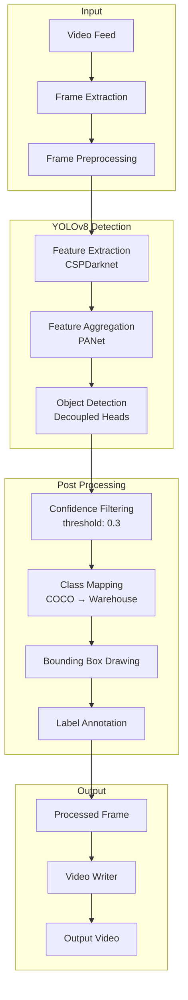
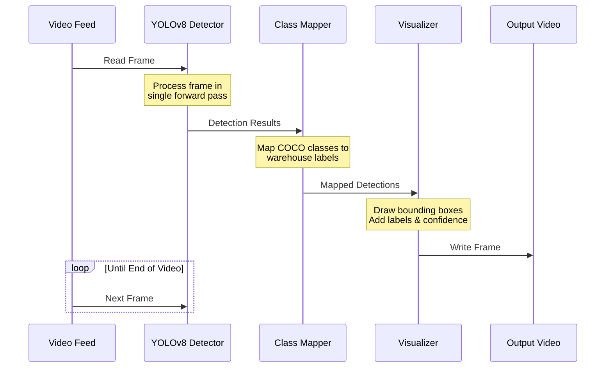
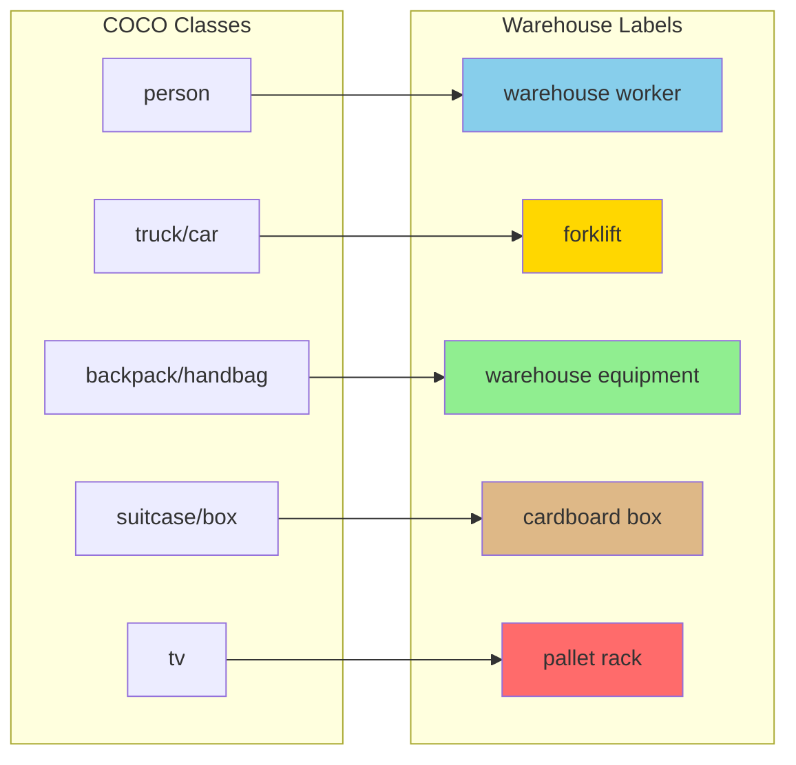
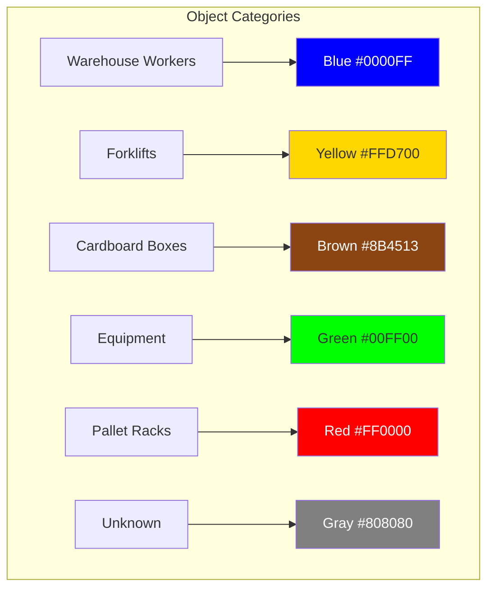
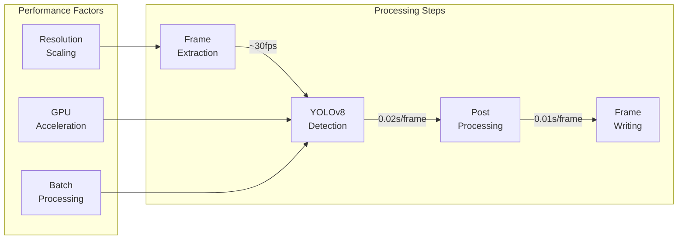

# Warehouse Object Detection Workflow

## System Architecture

## Detection Pipeline Flow

## Class Mapping System

## Color Coding System

## Performance Metrics

This workflow documentation visualizes the complete pipeline of our warehouse object detection system, from video input through detection and visualization to final output. The diagrams show the system architecture, detection flow, class mapping, color coding, and performance considerations.
